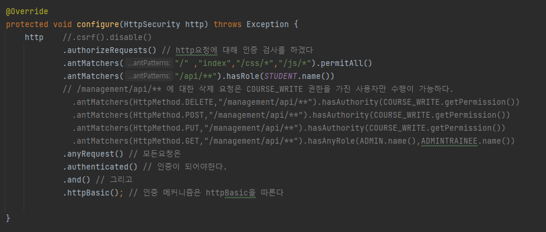
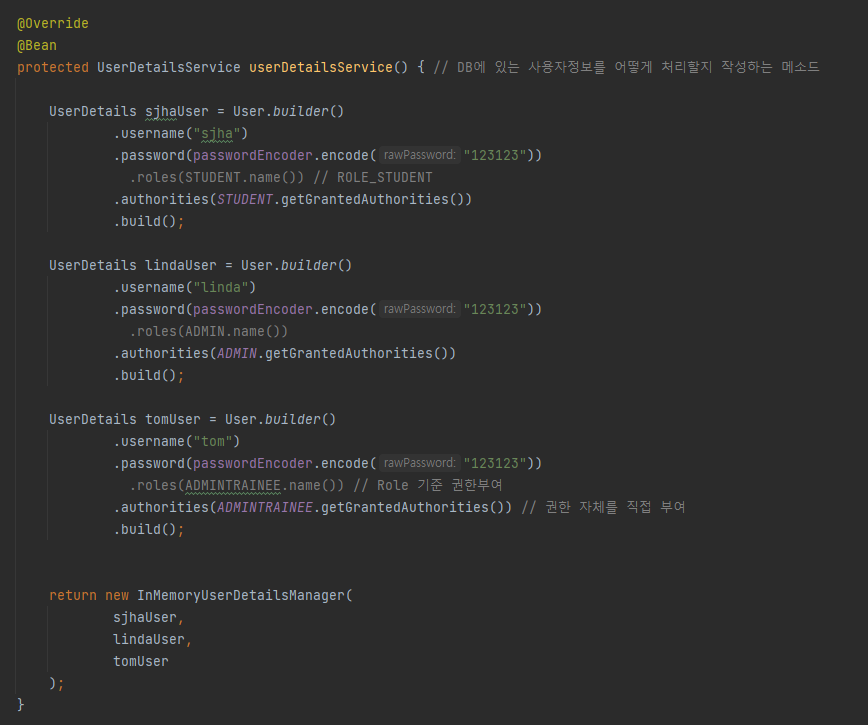
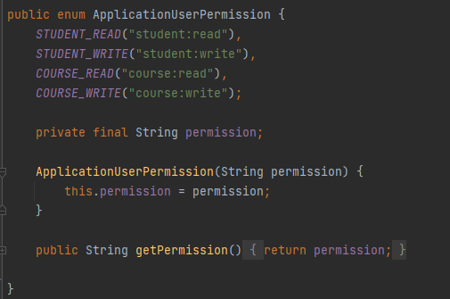
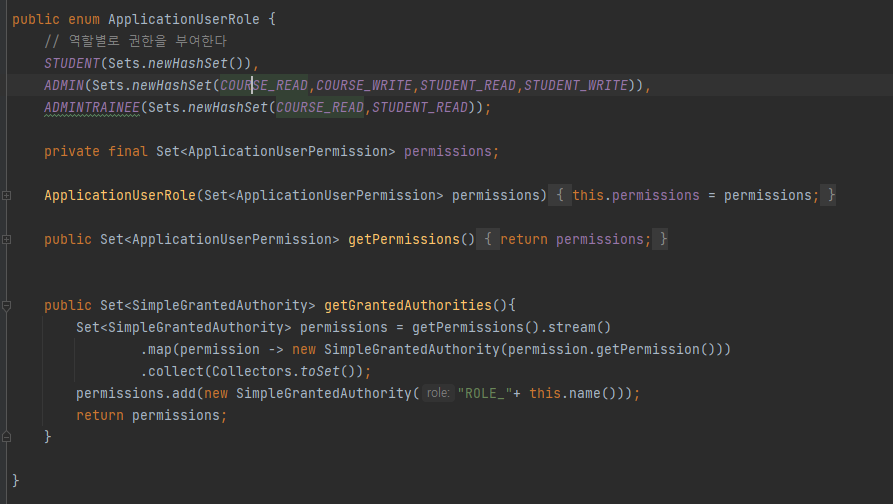

# 적용하기
- `org.springframework.boot:spring-boot-starter-security` 의존성을 추가하면 Spring Security를 사용할 수 있다. 
- 의존성을 추가하기만 해도 로그인을 위한 화면을 제공해준다.
- 서버에 있는 모든 리소스에 대해 인증을 요구하기 때문에 기본으로 제공하는 화면을 쓰는건 현실성이 없다.
- 클래스에 `@EnableWebSecurity`을 적용함으로써 인증을 커스터마이징 할 수있다.

# WebSecurityConfigurerAdapter의 configure
- `WebSecurityConfigurerAdapter` 추상 클래스를 상속함으로써 사용자 요청을 처리할 수 있다.
- `antMatchers`를 통해 리소스를 가져오고 `permitAll()`이나 `hasRole()`등을 호출함으로써 권한이나 역할에 따라 리소스 접근을 제어할 수 있다.
- 

# WebSecurityConfigurerAdapter의 userDetailsService
## InMemory 방식
- `userDetailsService` 메소드의 반환 인스턴스 타입을 `InMemoryUserDetailsManager`로 함으로써 InMemory 사용자 관리가 가능하다.
- ADMIN 같이 변화가 사실상 없는 사용자에 대해선 InMemory로 관리하는게 편하다.

### PasswordEncoder
- passwordEncoder를 통해 입력된 비밀번호를 Encoding을 해야 에러가 발생하지 않는다.
- PasswordEncoder는 인터페이스이며 구현체를 주입받아야하는데 가장 많이 쓰이는것은 `BCryptPasswordEncoder`이다.(`PasswordConfig.java` 참조)

# 권한과 역할
- 역할은 권한의 집합으로 이뤄져있다.
- 리소스 접근시 사용자의 역할 또는 권한을 확인함으로써 접근을 제어할 수 있다.
## 권한(Permission)
- enum타입으로 Permission을 정의한다. 이번 예시에선 STUDENT_READ라는 이름을 바로쓰지 않고, **student:read**와 같이 별도의 String으로 정의한다    

## 역할(Role)
- 역할별로 권한을 부여한다.
- 해당 역할에 대한 권한을 제공할때 GrantedAuthority 인터페이스의 구현체를 제공해야한다.
- `getGrantedAuthorities` 메소드의 마지막 부분에 ROLE도 추가로 넣어서 반환하는데 이부분은 이해가 필요할듯.(추후 학습후 설명 작성)

# EnableGlobalMethodSecurity 어노테이션
- 작성중...

